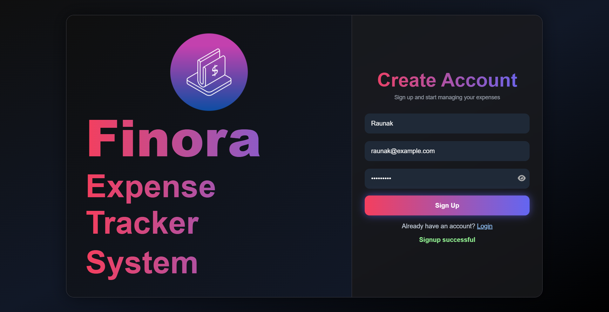
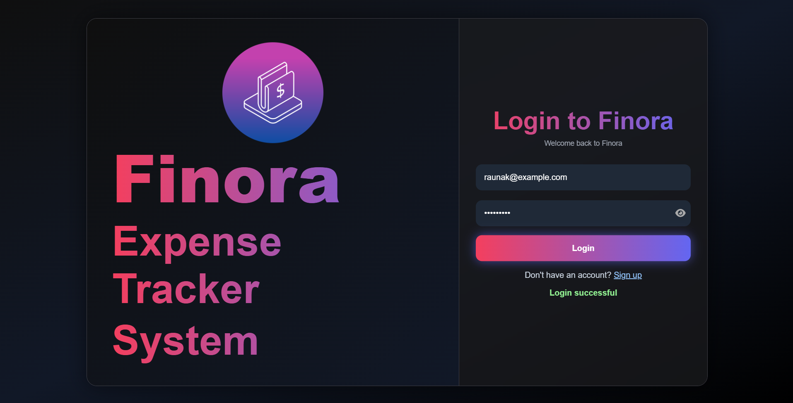
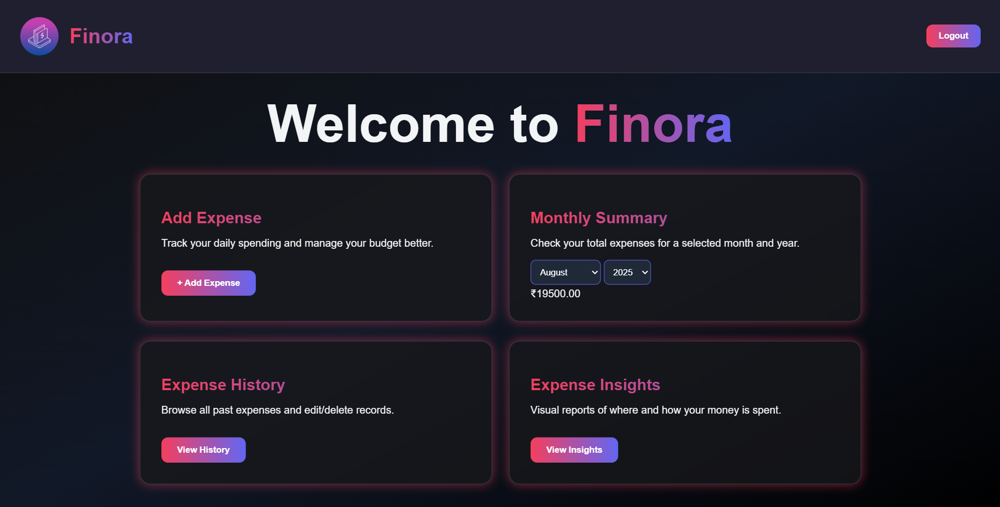
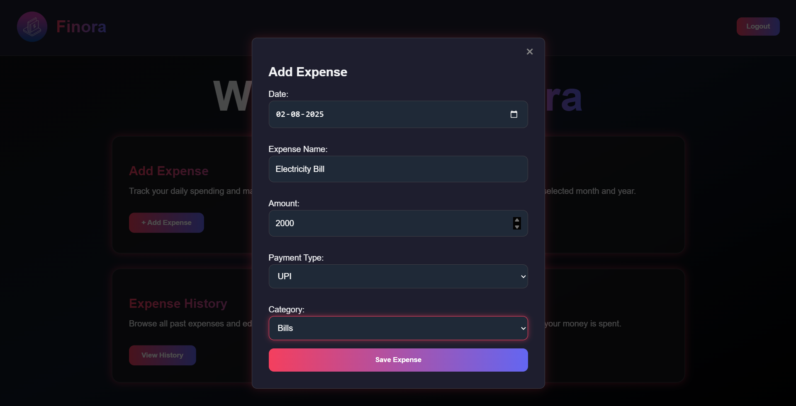
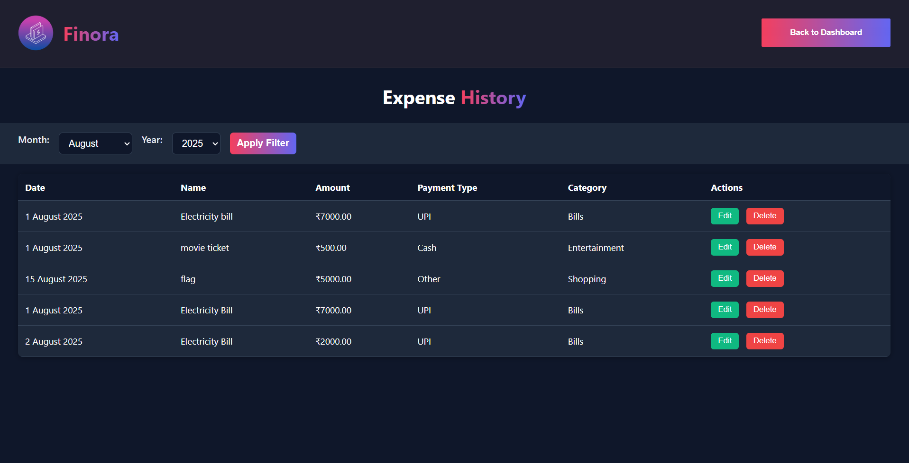
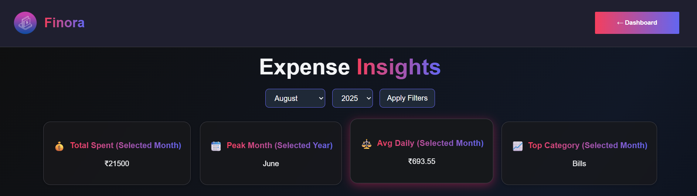
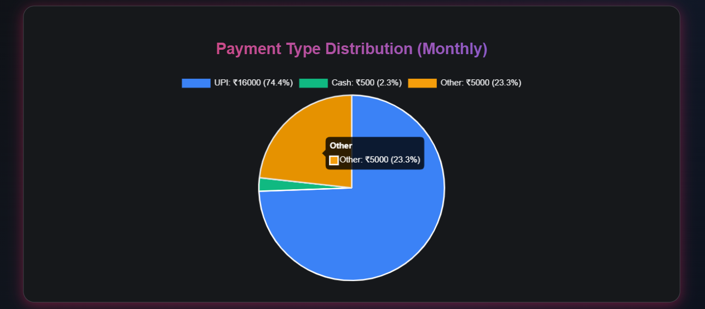
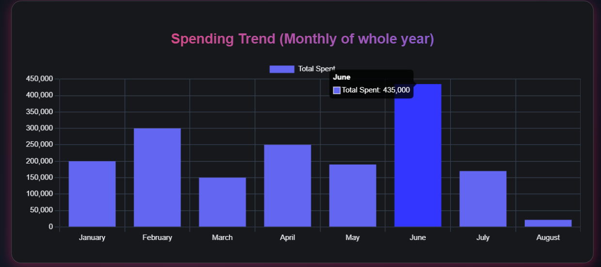
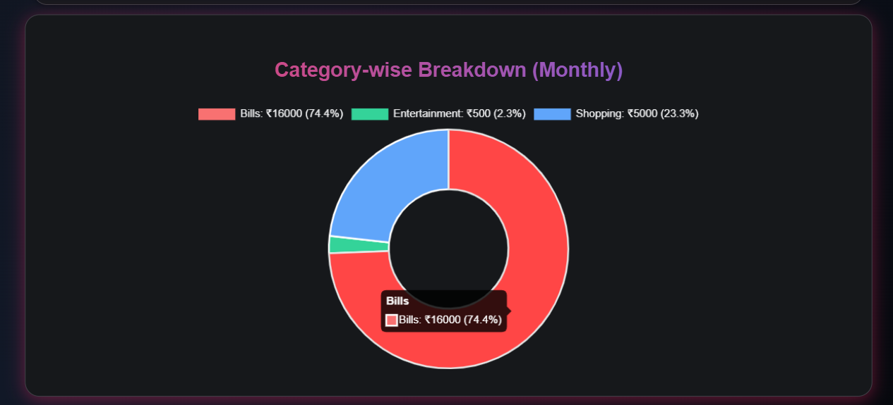
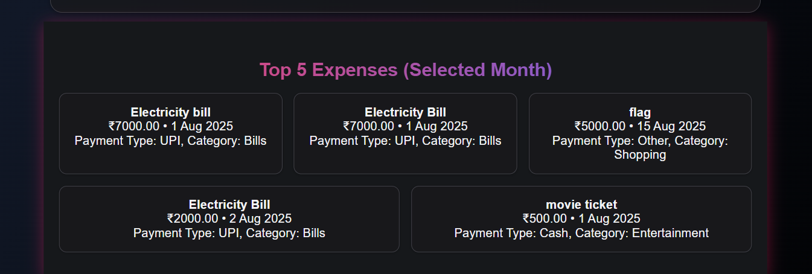

## 🌐 [Live Demo](https://example.com)  

# Finora – Expense Tracker System

Finora is a full-stack expense tracker system that helps users log, manage, and analyze their daily spending. It features a modern dark UI, powerful insights, and smooth user experience — built with Node.js, MySQL, HTML, CSS, and JavaScript.

---

## Screenshots & Features

### Signup Page  
New users can create an account using this clean and responsive form.


### Login Page  
Secure login screen for returning users to access their dashboard.


### Home Dashboard  
Central hub with 4 actionable cards: Add Expense, Summary, History, and Insights.


### Add Expense Modal  
A modal popup to add new expenses with fields like name, amount, date, mode, and category.


### Expense History  
View, filter, edit, or delete past expenses with a clean, responsive layout.


### Insights – Monthly Summary  
See total spent, peak month, average daily spend, and top category.


### Payment Type Distribution  
Visual pie chart showing spending distribution across payment modes.


### Monthly Spending Trend  
Line chart displaying monthly spending trends across the selected year.


### Category-wise Monthly Breakdown  
Bar chart showing spending distribution across different categories.


### Top 5 Expenses of the Month  
Highlights the highest individual expenses in the selected month.


---

## Tech Stack

- **Frontend**: HTML, CSS, JavaScript, Chart.js
- **Backend**: Node.js, Express.js
- **Database**: MySQL
- **Authentication**: JWT (JSON Web Tokens)


## How to Run Locally

1. **Clone the repository**
   ```bash
   git clone https://github.com/Raunak1303/Finora-Expense-Tracker-system
   cd finora
2. **Install dependencies**
    ```bash
    npm install
4. **Configure the database**

   Import the SQL from db/schema.sql into MySQL

   Create a .env file in root:
   ```bash
   DB_HOST=localhost
   DB_USER=youruser
   DB_PASSWORD=yourpassword
   DB_NAME=expense_tracker
   JWT_SECRET=your_jwt_secret

6. **Start the server**
    ```bash
    node backend/server.js
    Open your browser at http://localhost:3000

📧 Contact
Built with ❤️ by Raunak Raj Singh

📬 raunakrsingh16@gmail.com
